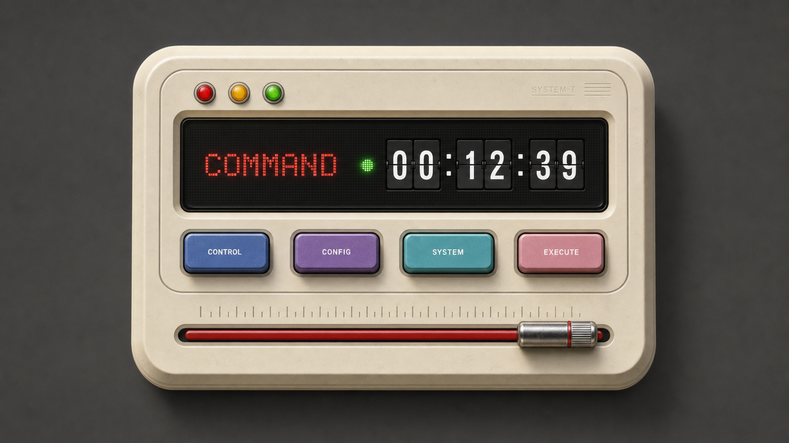

<p align="center"></p>

<div align="center">

#### 把你的 AI 订阅，变成任意客户端能用的本地 OpenAI 接口

[](https://git.io/typing-svg)

[](https://github.com/Amer-CN/proxydeck/releases)
[](#-快速开始)
[](#%EF%B8%8F-%E5%85%B3%E4%BA%8E%E5%85%8D%E8%B4%B9%E4%B8%8E%E8%BE%B9%E7%95%8C)
[](https://github.com/Amer-CN/proxydeck/releases)

</div>

---

你有 CommandCode、团结（Codely）、WorkBuddy（腾讯 CodeBuddy）的订阅，但它们
只能在自家客户端里用？**ProxyDeck 把这些订阅统一转成本地 OpenAI 兼容接口**
（`http://127.0.0.1:55990/v1`），Codex、Cursor、任何支持自定义 Base URL 的
Agent 都能直接接——一个 exe 双击即用，零安装零配置。

界面是一台**机械风操作面板**：奶油色机身、顶部红绿灯、黑色点阵屏、点火拉杆。
启动代理不是点按钮，而是把拉杆从左拉到右——伴随自检灯仪式和真实的棘轮音效。

## 🚀 快速开始

1. **下载**：从 [Releases](https://github.com/Amer-CN/proxydeck/releases) 下载
   `ProxyDeck.exe`（单文件，约 12MB，无需安装）
2. **点火**：双击打开，把 COMMAND 甲板的红色拉杆拉到最右
3. **接入**：在你的 AI 客户端里填——

```
Base URL:  http://127.0.0.1:55990/v1
API Key:   你的 CommandCode Key（commandcode.ai/studio → API keys）
```

支持的平台（各自有独立甲板和拉杆）：

| 平台 | 端口 | 登录方式 |
|---|---|---|
| CommandCode | 55990 | API Key |
| 团结（Codely） | 8788 | 自动读取 ~/.codely-cli 登录态 |
| WorkBuddy（CodeBuddy） | 8787 | 自动读取桌面端登录态 |
| Comate（百度） | 8786 | 自动读取 ~/.comate/cli-login.json |
| Qoder（阿里） | 8785 | 自动读取桌面端登录态 |
| B.AI | 8891 | 注水检测页填入密钥 |

> **平台各自需要你自己的有效订阅**——本工具只做接口转换，不含任何账号资源。

## 👀 界面一览



四颗模式键切换甲板；顶部黑色点阵屏实时显示运行状态；滚动页面有真实滚轮
棘轮声。悬停任意模型 1 秒，屏幕显示价格与上下文参数。

## ✨ 核心特性

- **🔥 点火拉杆**——机械仪式感的启停交互；运行中拉回最左即熄火
- **📊 消耗统计**——官网权威口径（金额/Token/额度）+ 本地统计，离线也可见
- **🎛️ 多代理托管**——每个平台独立后台进程，关窗口不停服务
- **🌍 七种语言**——简体/繁体/英/德/日/法/西一键切换
- **🔊 机械音效**——开关、挡位、拉杆、滚轮棘轮，操作全程有声音反馈
- **⚙️ 彻底关机拨杆**——平时关窗后台常驻；只有设置页拨杆连后台一起关

## 📜 更新日志

设置页内置折叠式更新日志（[完整历史](./CHANGELOG.md)）

## 🛡️ 关于免费与边界

- **开源免费**，仅供个人学习研究使用
- 界面视觉致敬 PommeToys 机械面板风格（非官方）
- 仅支持 Windows（依赖系统自带的 WebView2 运行时）
- 需要你自己拥有对应平台的有效订阅

## 🙏 来源与致谢

- 界面风格受 [PommeToys](https://pommetoys.app) 启发——那台机械面板太让人喜欢了

<div align="center">

Made by [@Amer-CN](https://github.com/Amer-CN) · 仅供个人学习研究

</div>
